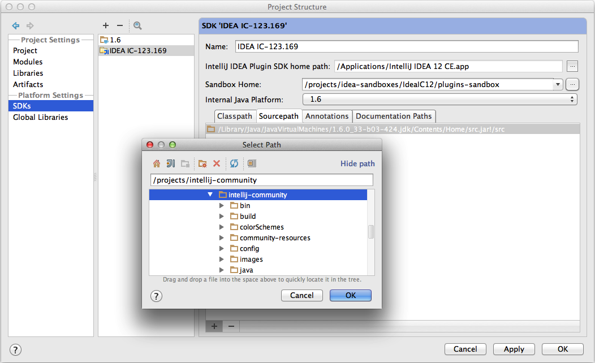
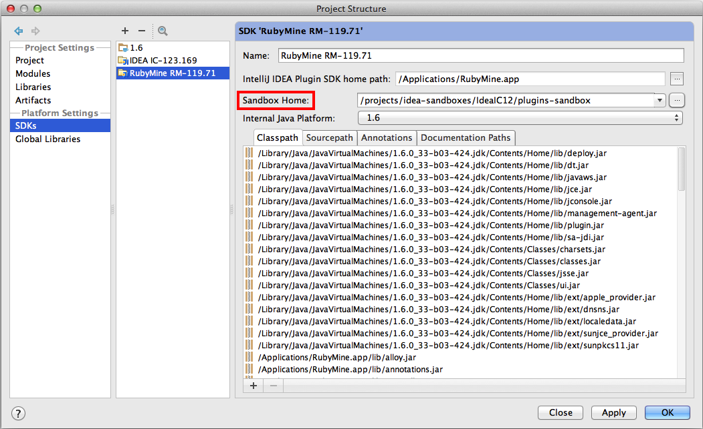

# Setting up a development environment

## Create an IDEA-Handlebars project
* Fork this project, clone it to your machine
* Launch IDEA and `File->Open...` the `handlebars` directory of this project
* Create a Plugin SDK for the project:
  * Open `File->Project Structure...`
  * For **Project SDK** click `New...` and choose "IntelliJ Platform Plugin SDK" (if you do not see that option, ensure that "Plugin DevKit" is enabled in `Settings->Plugins`)
  * Select the location of an IntelliJ IDEA install (Ultimate is recommended to access all features of the plugin, but Community Edition is also supported)
* At this point you should be ready to go!  Launch the "Handlebars" run configuration and start hacking.


## Add the IDEA source code
It is very handy to link the IntelliJ source code to your plugin SDK to help explore/understand the plugin code, and greatly improve the debugging experience.  Link the Community Edition Source in as follows:
  * Launch the install of IntelliJ IDEA you chose above for your SDK and find its build number (found under `IntelliJ IDEA -> About IntelliJ IDEA` on Mac, and `Help -> About` on Linux and Windows).  You should see something like `IC-123.169`; the `123.169` part is the build number
  * Clone the [IntelliJ IDEA Community Edition GitHub repo](https://github.com/JetBrains/intellij-community)
  * In your clone of the Community Edition, check out the tag that corresponds to the version of Community Edition you downloaded.  All tags for IDEA have the form `idea/<build_number>`, so the command for our example build number above is:

  ```
  git checkout idea/123.169
  ```
  * To get the latest tags in your clone, issue the following command:
  ```
  git fetch --tags
  ```
  * Open `File -> Product Structure...`
  * In the `Sourcepath` tab of the IDEA SDK you created above, add the directory where you cloned the Community Edition source code.



## Tips
* **Regenerating the lexer:** the heart of the plugin is the grammar defined in `/com/dmarcotte/handlebars/parsing/handlebars.flex`.  If you modify this grammer, you need to run `/com/dmarcotte/handlebars/parsing/jflex_generate.sh` to regenerate the class (`com.dmarcotte.handlebars.parsing._HbLexer`) which does the actual lexing in the plugin.
* **Enable Internal Tools:** add `-Didea.is.internal=true` to the VM Options of your plugin Run Configurations to add various internal IDEA-development tools to your menu options.  Many of these look interesting, but the one you absolutely need is `Tools -> View PSI Structure of Current File...`
* **Test against any Jetbrains IDE:** you can run your plugin build inside of any IDEA-platform-based IDE (the Ultimate Edition, Rubymine, PhpStorm, etc.) by setting up a Plugin SDK pointing at the install location of the IDE you want to test against.  You will not have the full source for most of these, but this comes in handy when backporting features, testing against an IDEA EAP, or troubleshooting IDE-specific problems.
    * *Note:* you do not need a license for any of the products you want to test against.  The plugin SDK will let you use a trial license, and you can "renew" this any time by deleting the **Sandbox Home** folder defined in `Project Structure -> SDKs`

    * There may be compilation errors in the test suite against non-IDEA SDKs since not all the products ship with the test framework.  To work around this, temporarily "Unmark as Test Source Root" `test/src`.
* **Hack on any open source plugin:** these setup instructions should apply for just about any plugin, so now you should be able to easily explore the code of [all of your favorite open source plugins](http://blogs.jetbrains.com/idea/2012/10/check-out-more-than-200-open-source-plugins/).
  * For plugins which do not have a `.idea` project in their source, you can consult the [legacy version of these instructions](https://github.com/dmarcotte/idea-handlebars/blob/master/developer_environment.md) for pointers on how to set up a project.

## Problems with these instructions?
Please let us know! The easy way to suggest improvements, point out gaps, or even just ask questions is to simply comment on one the commits for this file.