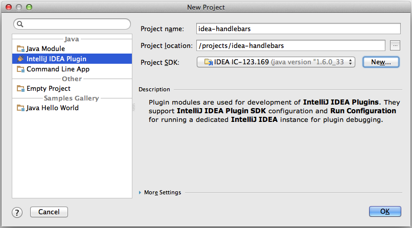

# Setting up a development environment

## Download IDEA and its sources
* Ensure you have the latest version of the open source [Intellij IDEA Community Edition](http://www.jetbrains.com/idea/free_java_ide.html)
* Launch your copy of the Community Edition and find its build number (found under `Intellij IDEA -> About Intellij IDEA` on Mac, and `Help -> About` on Linux and Windows).  You should see something like `IC-123.169`; the `123.169` part is the build number
* Clone the [Intellij IDEA Community Edition GitHub repo](https://github.com/JetBrains/intellij-community)
* In your clone of the Community Edition, check out the tag that corresponds to the version of Community Edition you downloaded.  All tags for IDEA have the form `idea/<build_number>`, so the command for our example build number above is:

```
git checkout idea/123.169
```
* To get the latest tags in your clone, issue the following command:
```
git pull --tags
```

## Create an IDEA-Handlebars project
* Fork this project, clone it to your machine, and launch IDEA (can be the Community Edition you downloaded above, or some other edition you use in your day-to-day work)
* In IDEA, create a new project from scratch, and configure it like the following, with `/projects/idea-handlebars` replaced with the path where you cloned your fork of the project
* Note that the project is of type **Intellij IDEA Plugin** (if you do not see that option, ensure that "Plugin DevKit" is enabled in `Settings->Plugins`)
* Also note that the **Project SDK** is set to `IDEA IC-\<build_number\>`.  To set this, click "New" and choose the location of your Community Edition install, then choose Java 1.6 when prompted

* Click `OK`. Once the project loads up, configure the resources and test directories:
    * right-click the "idea-handlebars/resources" folder, and choose `Mark Directory As->Source Root`
    * right-click the "idea-handlebars/test/src" folder, and choose `Mark Directory As->Test Source Root`
* Add the Intellij source code
    * Open the "Project Structure" pane (`File -> Product Structure`)
    * In the `Sourcepath` tab of your IDEA SDK, add the directory where you cloned the Community Edition source code.  This will make debugging and exploring the source much more pleasant.


## Ready to go
And that's it!  At this point, you should automatically have an `idea-handlebars` Run Configuration in IDEA (if not, create one of type "Plugin" and you should be good to go). If you Run/Debug this configuration, it will launch the Community Edition with your build of the plugin installed.

## Tips
* **Regenerating the lexer:** the heart of the plugin is the grammar defined in `/com/dmarcotte/handlebars/parsing/handlebars.flex`.  If you modify this grammer, you need to run `/com/dmarcotte/handlebars/parsing/jflex_generate.sh` to regenerate the class (`com.dmarcotte.handlebars.parsing._HbLexer`) which does the actual lexing in the plugin.
* **Enable Internal Tools:** add `-Didea.is.internal=true` to the VM Options of your plugin Run Configurations to add various internal IDEA-development tools to your menu options.  Many of these look interesting, but the one you absolutely need is `Tools -> View PSI Structure of Current File...`
* **Test against any Jetbrains IDE:** you can run your plugin build inside of any IDEA-platform-based IDE (the Ultimate Edition, IDEA 12 EAP, Rubymine, PhpStorm, etc.) by setting up a Plugin SDK pointing at the install location of the IDE you want to test against.  You will not have the full source for most of these, but this comes in handy when backporting features, testing against an IDEA EAP, or troubleshooting IDE-specific problems.
    * *Note:* you do not need a license for any of the products you want to test against.  The plugin SDK will let you use a trial license, and you can "renew" this any time by deleting the **Sandbox Home** folder defined in `Project Structure -> SDKs`

* **Hack on any open source plugin:** these setup instructions should apply for just about any plugin, so now you should be able to easily explore the code of [all of your favorite open source plugins](http://blogs.jetbrains.com/idea/2012/10/check-out-more-than-200-open-source-plugins/).

## Problems with these instructions?
[File an issue!](https://github.com/dmarcotte/idea-handlebars/issues?direction=desc&page=1&sort=created&state=open) Feel free to suggest improvements, point out gaps, or even just ask questions.